# VITyarthi-Project-1

# Hotel Management System

I have made a **Hotel Management System** as my VITyarthi project.

I made this project using **Python** and I used **VS Code** to write and run the code.

In this README, I will show how to download the required software, open my project and run it in VS Code.

---

# !!!!! Downloading !!!!!!

## 1st:- Downloading VS Code

First, download VS Code according to your system.

You can download VS Code from this link:

https://code.visualstudio.com/download

VS Code is available for:

- Windows
- Mac
- Linux

After downloading, install VS Code on your computer.

## 2nd:- Installing Python Extension in VS Code

After installing VS Code, we need to install the Python extension.

1. Open VS Code.
2. Go to the **Extensions** section.
3. You can also use:

   **Ctrl + Shift + X**

4. Search **Python** in the search bar.
5. Install the Python extension.

This extension helps us to run Python programs in VS Code.

## 3rd:- Installing Python

Now we need to install Python on our computer.

You can download Python from:

https://www.python.org/downloads/

Download Python according to your system and install it.

If you are using Windows, make sure to check:

**Add Python to PATH**

during installation.

# Now Setup is Done !!

Now VS Code and Python are ready.

We can now download my Hotel Management System project and run it.

---

# Downloading My Project

You can download my project from my GitHub repository:

https://github.com/shubhambyte-by/VITyarthi-Project

Open the repository and click on:

**Code → Download ZIP**

After downloading, extract the ZIP file.

You can also clone the repository if you already use Git.

# Opening Project in VS Code

After extracting the project:

1. Open the project folder.
2. Right click inside the folder.
3. Select **Open with VS Code**.

The project will open in VS Code.

You can also open it from VS Code using:

**File → Open Folder**

# Files in My Project

My Hotel Management System has different Python files.

- `main.py` - This is the main file of my project. We run this file to start the program.
- `GuestInfo.py` - This file is related to guest information.
- `Roominfo.py` - This file is related to room information.
- `Hotel_Data.py` - This file contains the hotel data used in the project.

The different files are connected with the main program.

## Project Structure

This is how my project looks in VS Code:

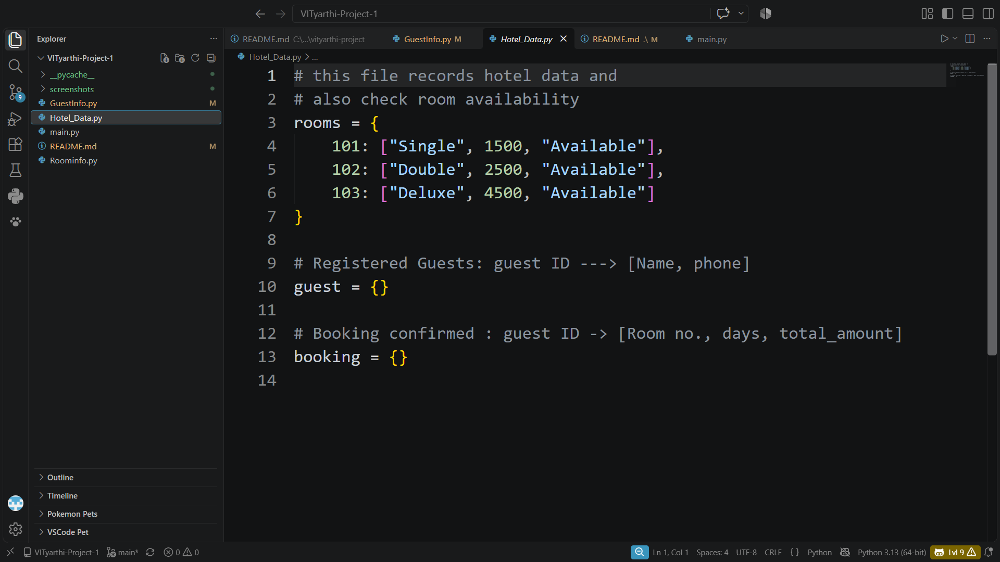 

---

# Running the Code

Now we can run the project.

Open the **main.py** file in VS Code.

Then go to the **Run** section and select:

**Run Python File**

You can also click on the **Run button** at the top - right corner.

After running the file, the program will start in the VS Code terminal.

# Now Next Steps Are Related to MY Project and Output

## Main Program

`main.py` is the main output file of my project.

When we run `main.py`, the Hotel Management System starts.

### Main Output

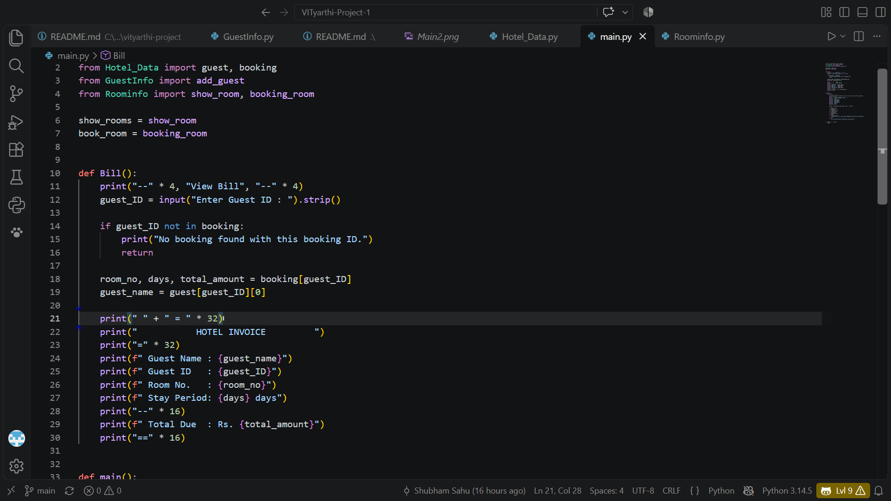
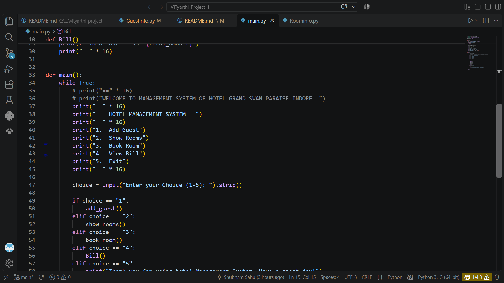
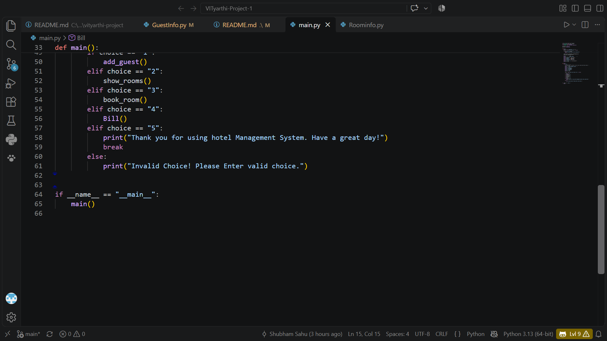

---

## Guest Information

The project also contains a separate file called `GuestInfo.py`, which is used for guest-related information.

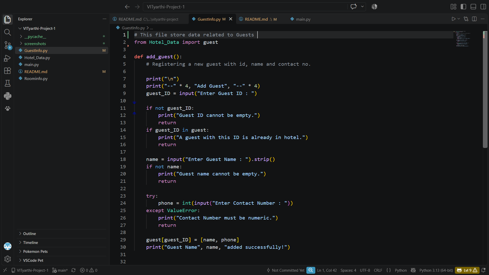

---

## Room Information

`Roominfo.py` is used for the room-related part of the project.

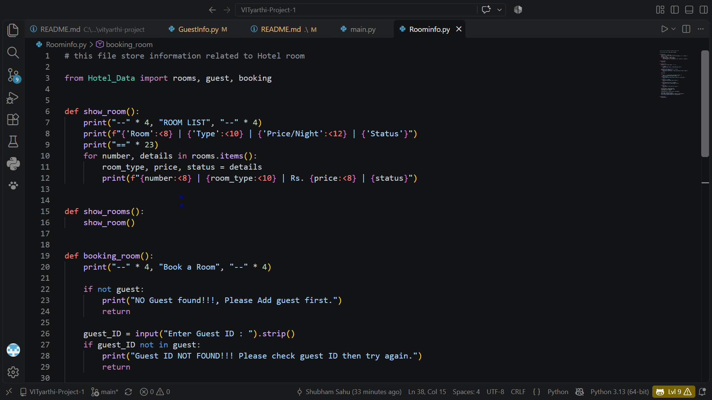
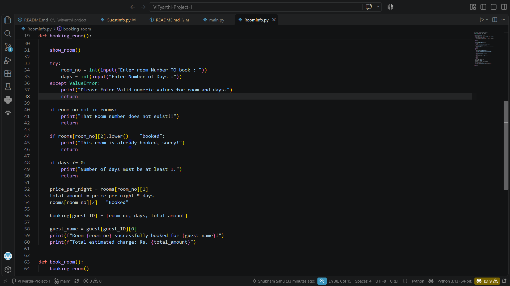

---

# Project Output

After running the program, we can use the options provided by the Hotel Management System.

The complete output of my project can be seen below
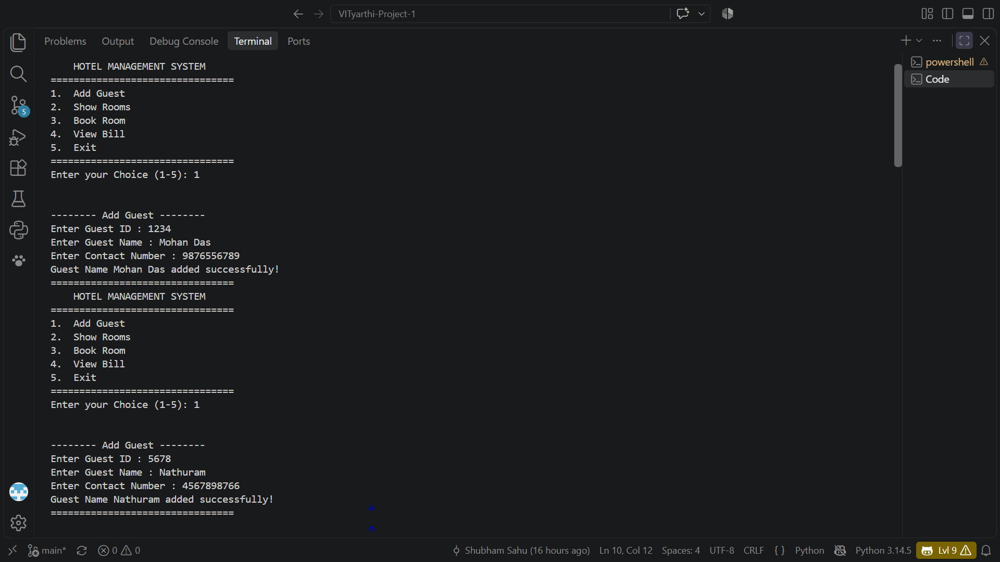
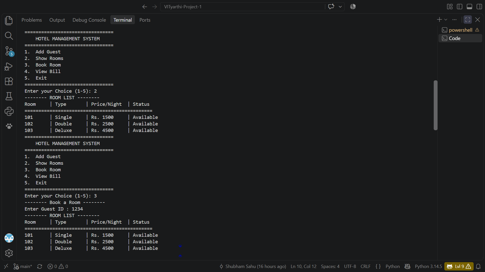
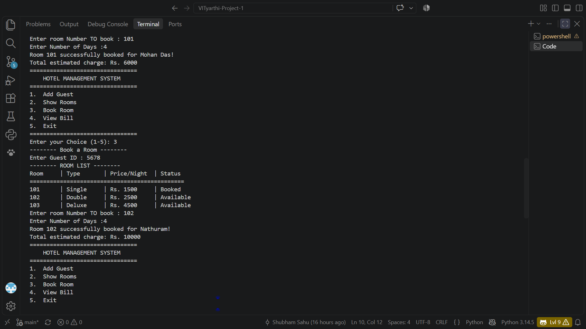
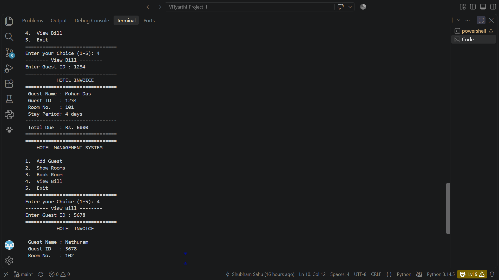
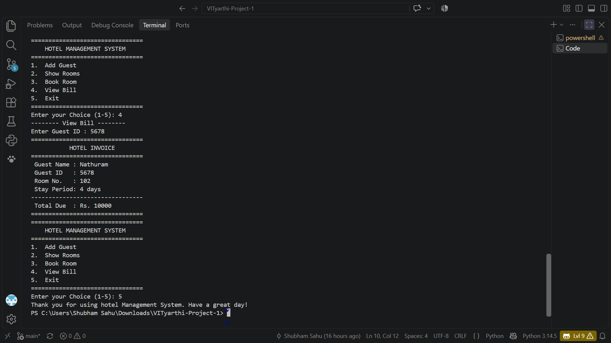

---

# Thank You 

Thank you for checking out my **Hotel Management System** project.

Made by
 
**Name - Shubham Sahu**
**REG. NO. 26BCE10056**
